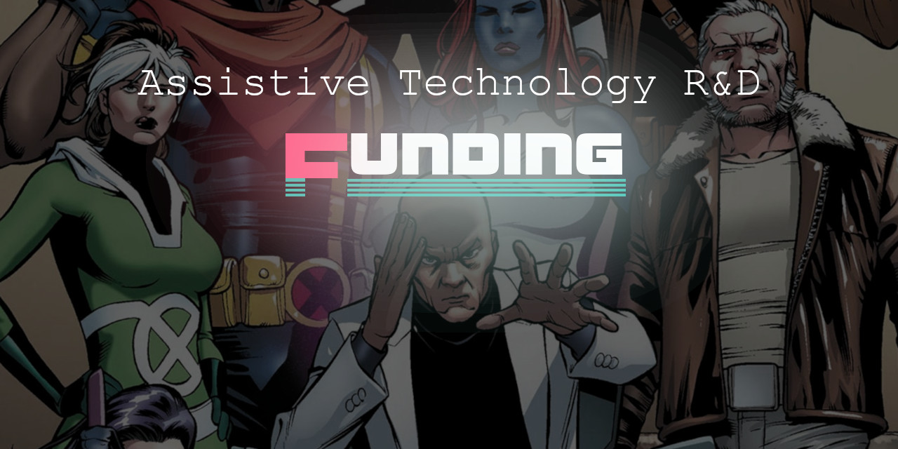

> **"Assistive Technology is the surest path towards developing real-life super abilities"** 
> \- [Oz Ramos](https://github.com/midiblocks)

There is a crazy amount of funding opportunities in tech, from grants and residencies to speaking opportunities and angel investments, incubators, and accelerators. Accessing these funds can be challenging however, especially if you're not even aware of what's available.

This repository is here to:

- **Help encourage continued research into Assistive Technologies.** Often times projects stop at the end of an experiment, internship, or when funding runs out despite the obvious impact projects may have on millions of people
- **Help you plan and structure your project so that it gets funded.** In the startup world there are battle tested strategies to maximize the chances of successfully getting funded, but there isn't a lot of info for designing fundable, high-impact research projects
- **Help reduce Impostor Syndrome and emphasize the potential impact of funded Assistive Tech.** Almost no one is successful overnight and because Assistive Tech does not usually address a mainstream demographic it is doubly important to focus on the potential impact and strategize for a long term game

 
 
 

> **How to contribute**
>
> Feel free to start an issue or make a PR request with any information you think may help. Please don't worry too much about formatting etc, as the list grows I'll organize everything a bit better :)

 
 
 

 
 
 

# Contents

- [Grants](/#grants)
- [Residencies](/#residencies)
- [Hackathons](/#hackathons)
- [Internships](/#internships)
- [Angels and Benefactors](/#angels-and-benefactors)
- [Incubators and Accelerators](/#incubators-and-accelerators)
- [Success Stories](/#success-stories)

 
 
 

 
 
 

# Grants

## General Grants

- (US) [Grants.gov](https://www.grants.gov/) - Grant search engine with grant writing tips and other resources. [Twitter @grantsdotgov](https://twitter.com/grantsdotgov)
- Don't forget to also check for local city or state/province level grants as well!

## Specific to Assistive Tech

- (Global) [TREAT Pilot Projects](https://www.treatcenter.org/grant-opportunities/) - $5k - $25k - TREAT offers Pilot Project grants to support the development and commercialization of novel rehabilitation and assistive technology ideas
- (US) [US Ignite](https://www.us-ignite.org/tools/fundings/) - A curation from Grants.gov for specifically for smart cities with many focused on accessibility

 
 
 

 
 
 

# Residencies
> 

-
-
-

 
 
 

 
 
 

# Hackathons
> 

-
-
-

 
 
 

 
 
 

# Internships
> 

-
-
-

 
 
 

 
 
 

# Angels and Benefactors
> 

-
-
-

 
 
 

 
 
 

# Incubators and Accelerators
> 

-
-
-

 
 
 

 
 
 

# Success Stories

-
-
-